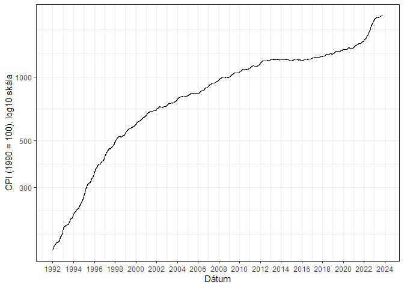

<!-- README.md is generated from README.Rmd. Please edit that file -->

# Infláció - HUF

<!-- badges: start -->

[](https://lifecycle.r-lib.org/articles/stages.html#experimental)
[](https://CRAN.R-project.org/package=PROJECTNAME)
<!-- badges: end -->

A project célja létrehozzon egy közérthető adatsort és ehhez tartozó
appot a KSH CPI adatsora alapján (amit a szerző véleménye szerint elég
nehéz megtalálni).

A KSH honlapján a megfelelő adatsort átalakítva lehet kinyerni szerintem
értelmezhető módon az adatsort; alternatívaként ezen a
[linken](statinfo.ksh.hu/Statinfo/QueryServlet?openLink=266cdc8349f09c829fff26480f5fe2da48cc728cddd7829c4ffe86b8be004966)
keresztül lehet elővarázsolni, de úgy, hogy a megnyíló oldalon **még
egyszer** be kell másolni a linket, majd az esetlegesen megnyíló második
oldalra **ugyanezt** a linket kell bemásolni és akkor megnyílik.
(statinfo.ksh.hu/Statinfo/QueryServlet?openLink=266cdc8349f09c829fff26480f5fe2da48cc728cddd7829c4ffe86b8be004966)

A könnyebben használható kalkulátor az átdolgozott adatsorral együtt itt
elérhető: [link](https://martynk.shinyapps.io/InflationAppHUF/)

További dokumentáció: [link](https://martynk.github.io/InflationAppHUF/)

## Összefoglalás

A KSH havi adatsorát átdolgoztam, napi bontásra. Az adatsor excelben az
*inst/backend/calculate_daily_data.xlsx* úton ebben a repóban is itt
van, de az appon keresztül is letölthető.

``` r
library(ggplot2)
load( here::here("inst","backend","calculate_daily_data.rdata"))

dat |>
  ggplot( aes( x = time, y = cpi)) +
  theme_bw() +
  theme( legend.position = "none") +
  geom_line()  +
  scale_x_date(date_breaks = "2 years", date_labels = "%Y") +
  labs( x = "Dátum",
        y = "CPI (1990 = 100), log10 skála") +
  scale_y_log10()
```



## Lokális verzió futtatása

Az appot az ingyenes Rstudio telepítése után lokálisan is futtathatjuk.

``` r
# install.packages("devtools")
devtools::install_github("MartynK/MartysProjectTemplate")
```
